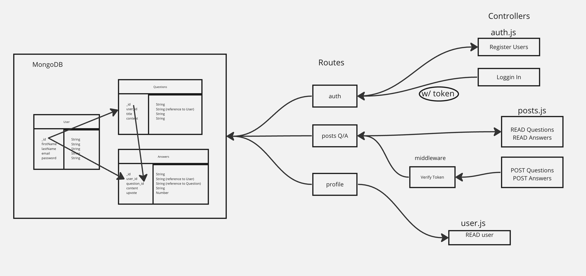

# Basic Forum App

## Team Members:

* Kirill Lesnykh
* Jonathan Tsai
* Laurel Perkins
* Mohammed Abubakar

# Project: Basic Forum App

This application is meant to allow users to both ask questions and reply to questions with answers. Users should not be able to edit other peoples questions/answers, but should be allowed to answer other's questions or ask their own questions.

## Installation

1. Clone the repository: ``
2. Navigate to the project directory: ``
3. Install dependencies: `npm install`

## Usage

To start the app, navigate to the app [website](netlifylinktowebsite.com)

## Contributing

Contributions to our Forum app are welcome! If you find a bug or would like to suggest an improvement, please open an issue or submit a pull request.

## License

This Forum app is licensed under the [MIT License](https://opensource.org/licenses/MIT).

## User Stories

- Register new User
- Login existing User
- READ any questions and answers
- If logged in, have the ability to POST questions or answers
- Verify user before any POST
- Establish answers that relate to a particular question
- Establish answer and questions related to the user

## Back-ebnd UML/Data Flow

